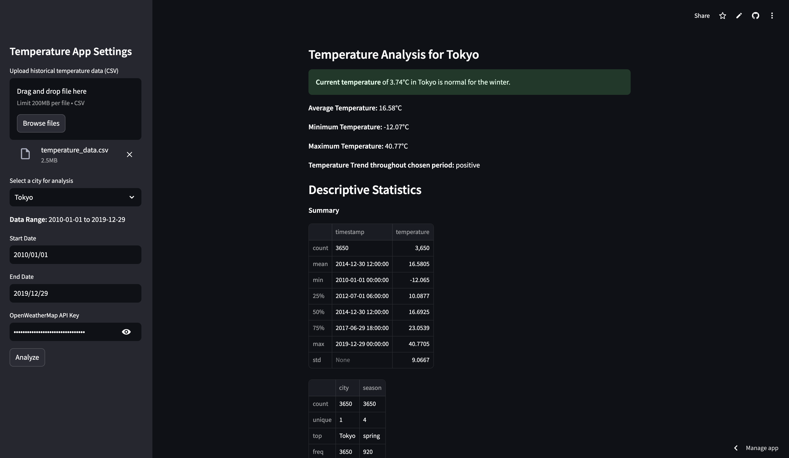
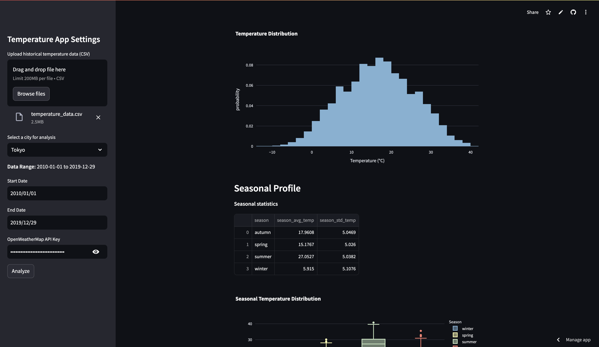
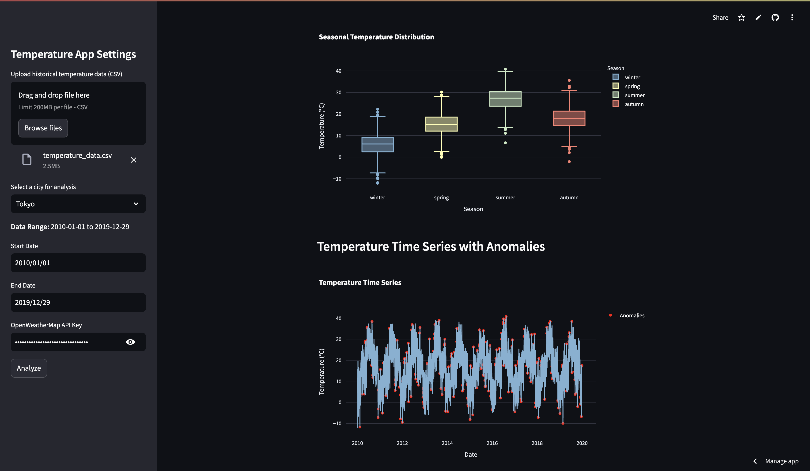
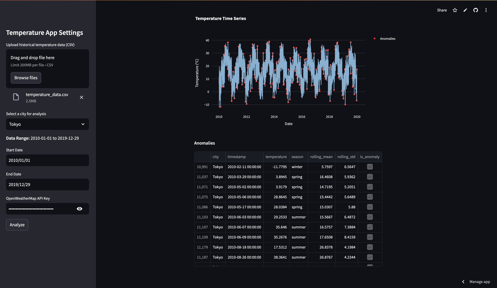

# Анализ температурных данных и мониторинг текущей температуры через OpenWeatherMap API

## Описание задания:
* Изучение климатических изменений и мониторингом температур в разных городах
* Проведение анализа исторических данных о температуре для выявления сезонных закономерностей и аномалий
* Получение текущей температуры в выбранных городах через API OpenWeatherMap для сравнить с историческими данными

## Этапы выполнения:
1. **Анализ исторических данных**
  * Вычисление скользящие средние температур с окном в 30 дней для сглаживания краткосрочных колебаний
  * Выявление исторически аномальные значения температур на основе скользящего среднего
  * Определение профили сезонов
  * Реализация решений без и с распараллеливанием вычислений для оценки и сравнения затраченного времени на работу
2. **Мониторинг текущей температуры**
  * Подключение к OpenWeatherMap API для получения текущей температуры города
  * Проведение проверки текущей температуры на аномальность
  * Реализация синхронного и асинхронных решений для оценки и сравнения затраченного времени на работу 
3. **Создание приложения на Streamlit**
  * Создание интерфейса для загрузки файла с историческими данными
  * Создание интерфейса для выбора города (из выпадающего списка)
  * Создание формы для ввода API-ключа OpenWeatherMap
  * Отображение описательной статистики
  * Отображение временного ряда температур с выделением аномалий
  * Отображение сезонных профилей
  * Вывод текущей температуры через API с определением аномальности для нынешнего сезона

## Результаты и выводы:
1. **Анализ исторических данных**
  * [Анализ исторических данных - эксперименты](https://github.com/leqtr/AI_Applied_Python/blob/main/HW1/AI_Applied_Python_HW1_Ле_Куанг_Чи.ipynb)
  * Реализованы все базовые требования к этапу
  * Реализованы **последовательное**, **с многопоточностью**, **с многопроцессностью** решения
    * тип решения: медианное время в секундах, \[5%, 95%\] - интервал
    * последовательное: 1.31, \[1.27, 2.25\]
    * многопоточность: 1.51, \[1.36, 2.24\]
    * многопроцессность: 1.50, \[1.37, 2.46\]
  * Распараллеливание не помогло ускорить вычисления, предположительно, из-за маленького объема данных и расчетов
    * в сравнении с которыми накладные расходы на организацию распараллеливания весят много и не результируют в итоговом выигрыше в скорости
2. **Мониторинг текущей температуры**
  * [Мониторинг текущей температуры - эксперименты](https://github.com/leqtr/AI_Applied_Python/blob/main/HW1/AI_Applied_Python_HW1_Ле_Куанг_Чи.ipynb)
  * Реализованы все базовые требования к этапу
  * Реализованы **синхронный** и **асинхронный** подходы
    * тип решения: время одноразовой реализации в секундах
    * синхронное: 4.32
    * асхинхронное: 2.07
  * Асинхронный подход дает ощутимый прирост в скорости (более, чем в 2 раза)
    * чтобы было совсем справедливо, надо бы итерации погонять и построить доверительные интервалы как в п.1.
3. **Создание приложения на Streamlit**
  * [Развернутое Streamlit приложение](https://leqtr-temperature-app.streamlit.app/)
  * Реализованы все базовые требования к приложению
  * Дополнительно реализованы
    * графики через `plotly` для интерактивности
    * возможность выбора временного периода для анализа
    * отображение общего распределения температуры в выбранном городе за весь период
    * отображение распределения температур в разрезе сезонов с помощью боксплотов
    * отображение множества аномальных температур (по скользящему среднему) по датам в виде датафрейма

