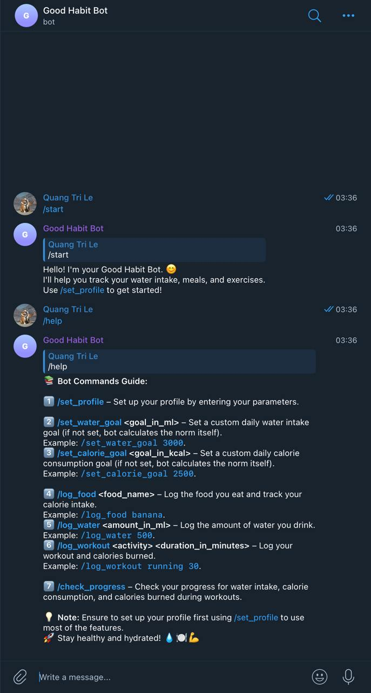
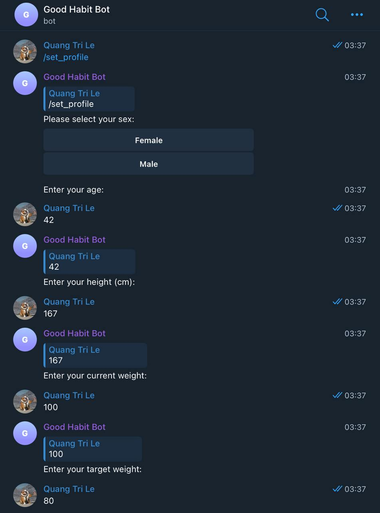
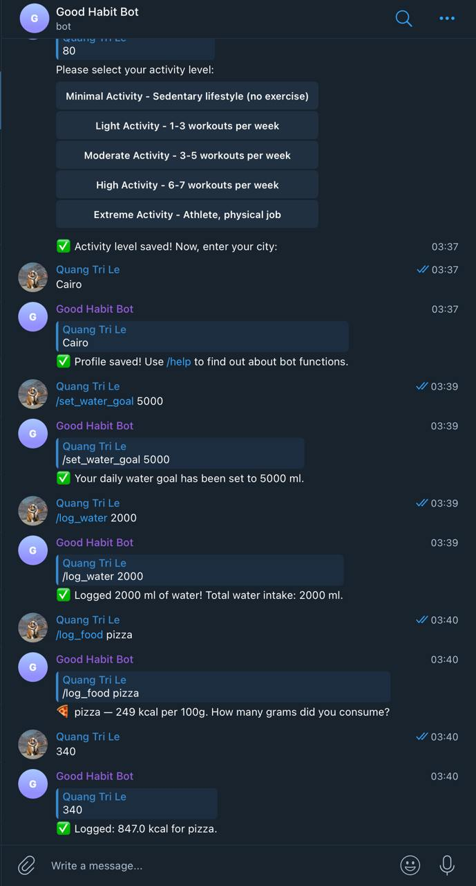
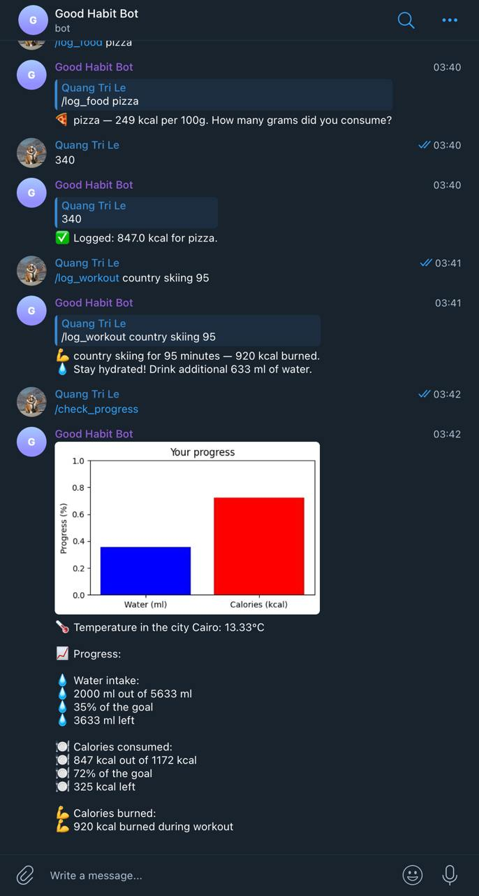
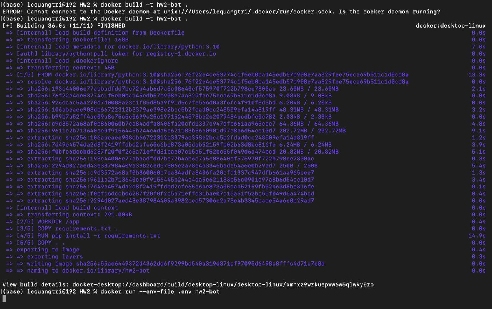
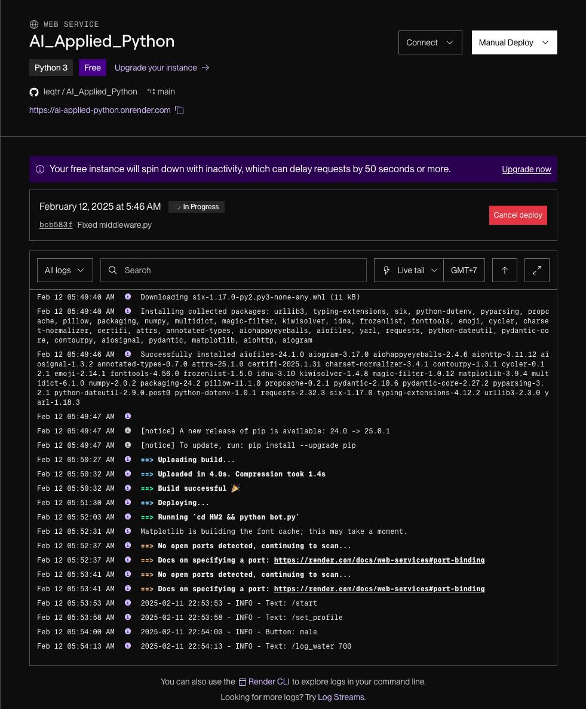

# Telegram-бот для расчёта нормы воды, калорий и трекинга активности

## Описание задания:
Задача — создать Telegram-бота, который помогает пользователю рассчитать дневные нормы воды и калорий, а также отслеживать тренировки и питание.

 1. **Рассчитать индивидуальные дневные нормы воды и калорий:**
	 - Учитывайте параметры пользователя, уровень активности, текущую погоду и потребляемую еду.
	 - Используйте реальные данные продуктов через API или иным способом.
 2. **Добавить функции трекинга:**
	 - Логировать тренировки и пересчитывать расход калорий. 
	 - Логировать питание и добавлять потреблённые калории в расчёты.
 3. **Создать интерактивный Telegram-бот:**
	 - Настройка профиля (вес, активность, город).
	 - Отчёт о текущем прогрессе по воде и калориям.
  
## Описание функционала тг-бота
0. ***/start*** - запуск бота и приветствие
1. ***/set_profile*** - начало заполнения формы с данными о пользователе
	- Пол (кнопки)
	- Возраст
	- Рост
	- Текущий вес
	- Желаемый вес
	- Уровень активности (кнопки)
	- Город
2. ***/set_water_goal*** - установка собственной нормы по воде
	- если не установить, бот сам считает норму по формуле  (*вес пользователя * 30 + поправка на уровень активности*; норма позже может поменяться в зависимости от температуры в городе и проведенных тренировок)
3. ***/set_calorie_goal*** - установка собственной нормы по калориям
	- если не установить, бот сам считает норму по [формуле Миффлина-Сан Жеора](https://calculatorium.net/body/mifflin-st-jeor-equation) (с поправкой на уровень активности и разницу между текущим и желаемым весами)
4. ***/log_food*** - логгирование потребленной еды
	- по названию продукта бот ходит в **OpenFoodFacts API** и пытается узнать его калораж
	- затем записывает объем к себе с учетом веса потребенного продукта
5. ***/log_water*** - логгирование выпитой воды
6. ***/log_workout*** - логгирование тренировок
	- по названию активности бот ходит в **API-NINJAS API** и пытается узнать кол-во сожженных калорий за час упражнений
	- затем записывает объем к себе с учетом длительности активности
	- на основании длительности активности бот добавляет определенный объем воды к норме и сохраняет его (с нормой калорий принято решение так не делать, так как норма калорий учитывает активность и обычно не варьируется от наличия тренировки, но логика была бы той же)
7. ***/check_progress*** - выводит прогресс пользователя по выпитой воде, потребленным и сожженным калориям, а также погоду в локации
	- температура в городе (в зависимости от нее, к норме воды может быть добавлена поправка)
	- статистика по выпитой воде (сколько выпито, сколько осталось, %)
	- статистика по потребленным калориям (сколько потреблено, сколько осталось, %)
	- график прогресса для визуального удобства
8. ***/help*** - выводит справку по функционалу бота для удобства пользователя

## Особенности
1. Заменена активность в минутах на категорийную активность в виде кол-ва тренировок в неделю - менее расплывчатая формулировка, простая для оценки пользователем
2. Есть возможность устанавливать личные цели по воде и калориям, если подкапотные формулы расчета бота не устраивают пользователя
3. Помимо дефолтных параметров, учтены пожелания по весу, пол, уровень активности для формирования нормы по калориям
4. Команда логгирования воды не указывает кол-во остатка по норме, так как этот функционал уже присутствует в команде проверки прогресса
5. Реализованы валидации входящих параметров пользователя (исходя из здравого смысла)
6. Добавлена попытка перевода еды/активности в эмодзи для повышения привлекательности взаимодействия пользователя с ботом (как и, в целом, эмодзи для разнообразия текста)
7. Работа с токенами организована через **config** и **.env**
8. Данные о пользователях хранятся в памяти
9. Есть возможность, как локального деплоя через **Docker**, так и на render.com
10. Реализовано простое логгирование команд присылаемых пользователем с текстом/кнопкой 

## Работа бота

## Деплой

